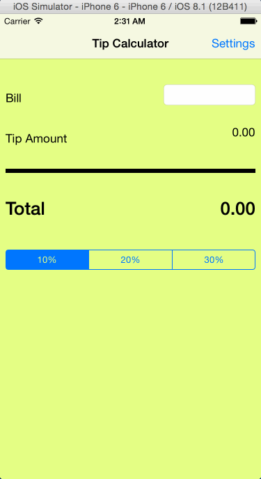

TipCalculator iOS Demo

This is an iOS demo application for calculating the tip.

Time Spent: 2 hours

Features:

User can calculate Total and Tip amount for upto  10 or 20 or 30% of the bill amount.

Notes:

Spent some time initally going through the Objective C and the tutorial videos.
Also played around with the editor a bit.

Walkthrough:

GIF created with [LiceCap](http://www.cockos.com/licecap/).

